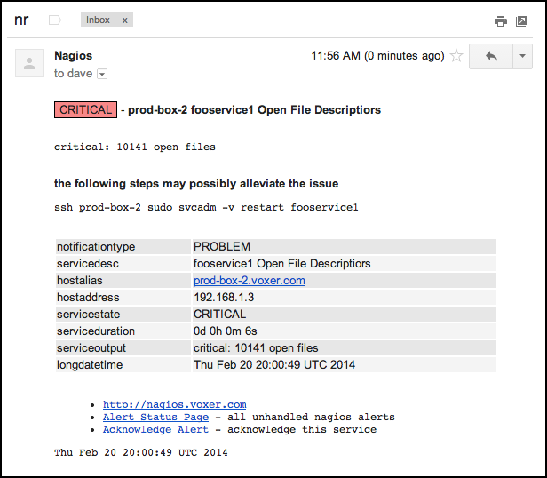
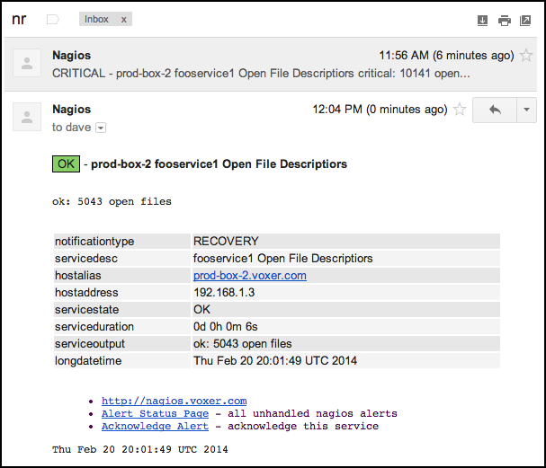
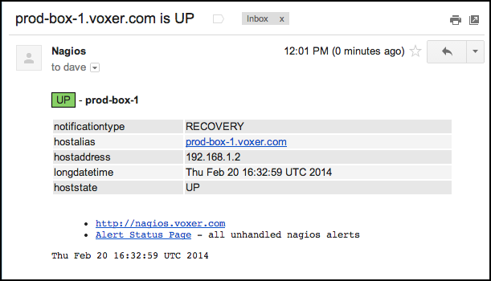

Nagios HTML Email Template
--------------------------

Generate HTML emails for Nagios service and host alerts

- [Quick Start Guide](#quick-start-guide)
- [Screenshots](#screenshots)
- [Advanced Usage](#advanced-usage)
	- [Custom Subject](#custom-subject)
	- [Alleviation Steps](#alleviation-steps)
- [Custom Templates](#custom-templates)
	- [Rendering](#rendering)
	- [Testing](#testing)
- [Common Problems](#common-problems)
- [License](#license)

Quick Start Guide
-----------------

Install this package on your nagios server

    [sudo] npm install -g nagios-html-email

And modify `commands.cfg` (or similar) to use this program

``` bash
define command {
    command_name notify-service-by-email
    command_line nagios-html-email service http://nagios.example.com | mailx -t
}
define command {
    command_name notify-host-by-email
    command_line nagios-html-email host http://nagios.example.com | mailx -t
}
```

The second argument of `http://nagios.example.com` is optional, and if supplied, should be
the base URI of your Nagios instance.  If present, it will result
in extra links in the email generated like like "acknowledge alert", "view all
alerts", etc.

Restart Nagios, and you should get fancy HTML email alerts.  If something
doesn't work, check the [Common Problems](#common-problems) section below for
possible solutions. The most common problem is `nagios-html-email` isn't in the
PATH of the Nagios server.

Screenshots
-----------

A critical service

<p></p>

The service recovery, threaded because the subject is the same

<p></p>

Host recovery

<p></p>

Advanced Usage
--------------

Note that these tips are only useful if you use the builtin templates supplied
by this program, or use the variables that the builtin templates use.

### Custom Subject

A custom subject can be set by setting a `_subject` attribute on the host
or service that is generating the alert, for example:

``` bash
define service {
    use                 generic-service
    hostgroup_name      server
    service_description SSH
    check_command       check_ssh
    _subject            ssh
}
```

Now, whenever the `check_ssh` service generates an alert, it will be sent with
the subject of simply `ssh`, regardless of notification type or service state.
This is convenient for threaded email clients (like gmail), as all emails
about the `check_ssh` service will be grouped in the same thread.

``` bash
define host {
    host_name  prod-box-1.voxer.com
    use        generic-host
    hostgroups server
    _subject   prod box 1
}
```

Same as above, except for a host notification for `prod-box-1.voxer.com`.
Whenever this host generates a notification, it will be sent with the simple
subject of `prod box 1`.

At Voxer, we use the `_subject` attribute of services and not hosts.

### Alleviation Steps

At Voxer, we use Chef to manage our Nagios instance, and as such, programatically
generate Nagios services for each production service we have.  All of our production
services are uniquely named like service1, service2, service3, etc. regardless of
the host that runs the service, so a separate Nagios service must be created for each
production service.

One of the things we check is memory usage on a per process basis.  Every node process
running in production is set to warn us when it passes a certain threshold of RSS on the box,
and under typical circumstances we just get a core dump of the process, and restart it.

After we have a couple core dumps, it becomes unecassary to waste time dumping core,
so we just restarted the troubled programs before they become a issue.

Since the "alleviation" steps are pretty much the same for each service, but we don't
want this to happen automatically (imagine if every service restarted at the same time...
that would be bad), we just add an `_alleviate` attribute to each service, that the
builtin template knows how to render.  For example:

``` bash
define service {
    use                 generic-service
    host_name           prod-box-1
    service_description fooservice1 RSS
    check_command       check_voxer_rss!fooservice1
    _subject            fooservice
    _alleviate          ssh prod-box-1 sudo svcadm -v restart fooservice1
}
```

Now, whenever an email is generated for the service when it is not `OK`, extra
lines will be added that look like:

```
the following steps may possibly alleviate the issue

ssh prod-box-1 sudo svcadm -v restart fooservice1
```

However, it is still up to the recipient of this alert to determine if this is the
best course of action.

Custom Templates
----------------

By default, this program will use builtin templates for host and service
alerts.  You can use your own templates by supplying `-t <dir>` to point to a
directory with your templates.

See [templates/](templates) to see the builtin templates.

### Rendering

Templates are rendered using [ejs](https://github.com/visionmedia/ejs), and
have these variables available for you to use.

- `nagios`: this object contains all of the Nagios variables found as
  environmental variables.  For example, `nagios.CONTACTEMAIL`,
  `nagios.HOSTSTATE`, etc.  Any variable you could access as a macro like
  `$MACRONAME$` will be avaliable as `nagios.MACRONAME`.
- `args`: this array contains all of the command line arguments after the type
  argument.  For instance, if the program is invoked as `nagios-html-email -t
  /etc/templates -s subject service foo bar baz` the array will be set to
  `['foo', 'bar', 'baz']`.
- `package`: `package.json` from this module as an object; this can be used
   to get information like `package.version`, etc.

A custom template dir, if you supply one, should contain at least a
`host.html.ejs` and `service.html.ejs` file for host and service alerts
respectively.

### Testing

To test out custom templates, it's easiest to clone this repo and use the
the example environmental variables for a fake Nagios alert.

First

    git clone git://github.com/Voxer/nagios-html-email.git
    cd nagios-html-email
    npm install

Next, edit the templates

    $ vim templates/*.html.ejs
    ... edit edit edit ...
    :wq

Then, run `make` to generate test templates

    $ make
    . test/service.env && ./nagios-html-email.js service | awk 'NR > 5' > service.html
    . test/host.env && ./nagios-html-email.js host | awk 'NR > 5' > host.html
    $ ls *.html
    host.html     service.html

Now you can open both HTML files to see what the templates looks like when they are rendered

    open *.html

Or, if you prefer, you can do this manually with the following

    . test/service.env
    ./nagios-html-email.js service > service.html
    open service.html || xdg-open service.html

Repeat the edit and testing steps until your templates look good, and then you can
call the globally installed `nagios-html-email` program with `-t /path/to/your/templates`
to use your newly created templates.

Common Problems
---------------

### No emails are being generated

Most likely, the path with `nagios-html-email` in it is not in the `PATH`
variable for the Nagios server.  Ensure the path given by `which
nagios-html-email` is in the PATH of the Nagios server.

### I'm getting emailed, but it is a JSON stringified version of the Nagios variables

This means that a template failed to render.  Instead of failing
to send an email, this program will do everything it can to make sure you
get an email, even if it isn't pretty.

### I'm trying to do numerical analysis on values but it isn't working

Since variables are passed as either command line arguments or
environmental variables, all variables are of type `String`.  You
must expliticly cast any values you know to be numbers, booleans,
dates, etc. to their correct data type.

### I've disabled environmental variables for performance reasons

You can still use this program, just pass the variables you would like to
use as command line arguments, and access them in your template as
`args[0]`, `args[1]`, etc.  For example:


``` bash
define command {
    command_name notify-service-by-email
    command_line nagios-html-email -s "** $NOTIFICATIONTYPE$ Service Alert: $HOSTALIAS$/$SERVICEDESC$ is $SERVICESTATE$ **" -a $CONTACTEMAIL$ service | mailx -t
}
```

However, from experience, passing environmental variables won't cause too much
of a performance penality. I'd recommend turning it on for a bit to see how it
affects your latency before turning off such an amazing feature.

License
-------

MIT
